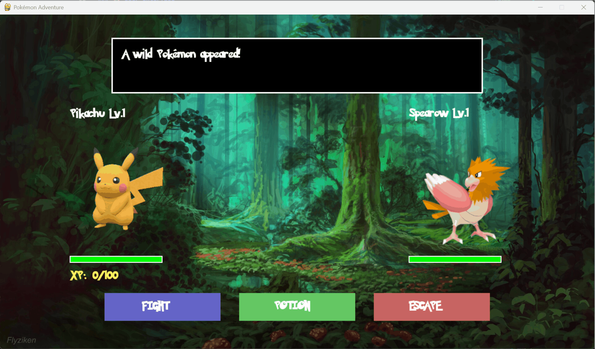
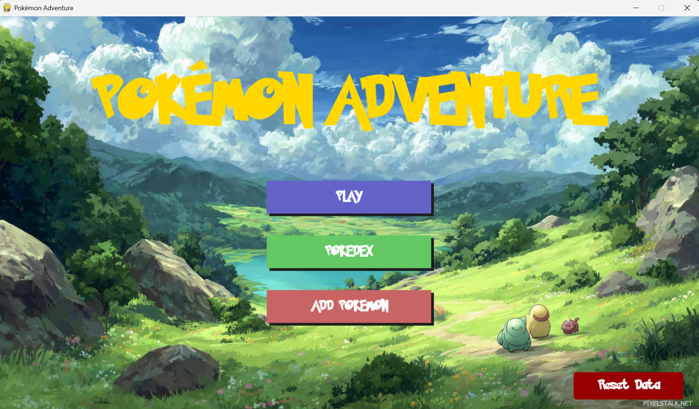
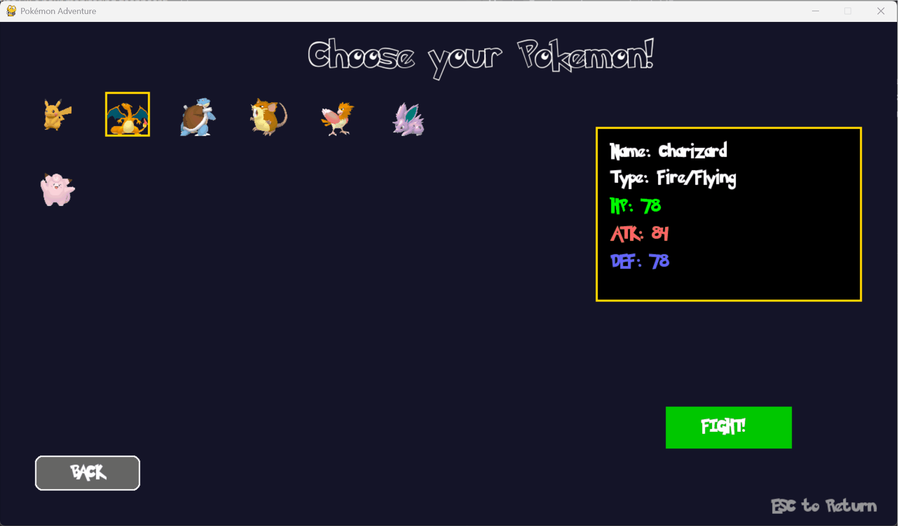
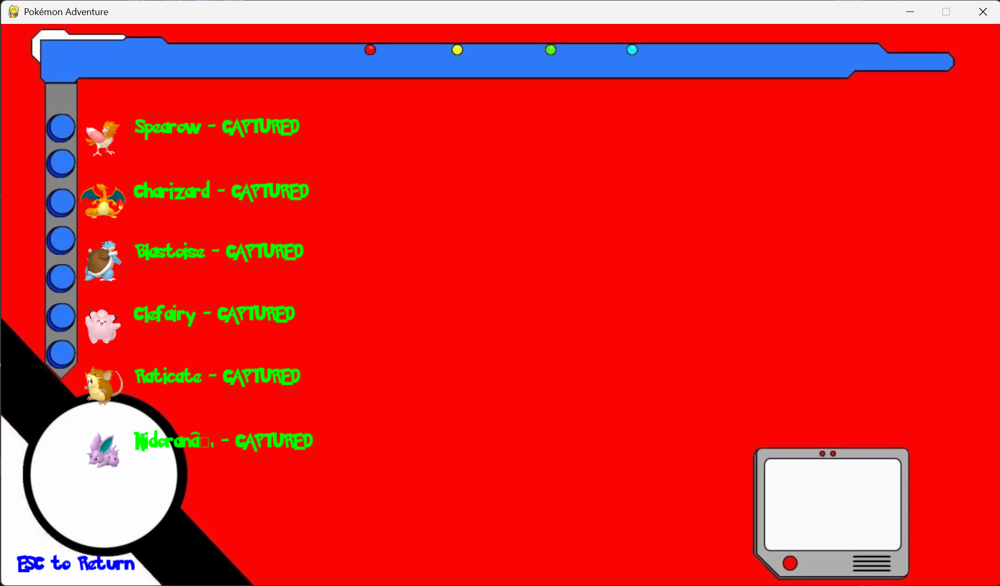
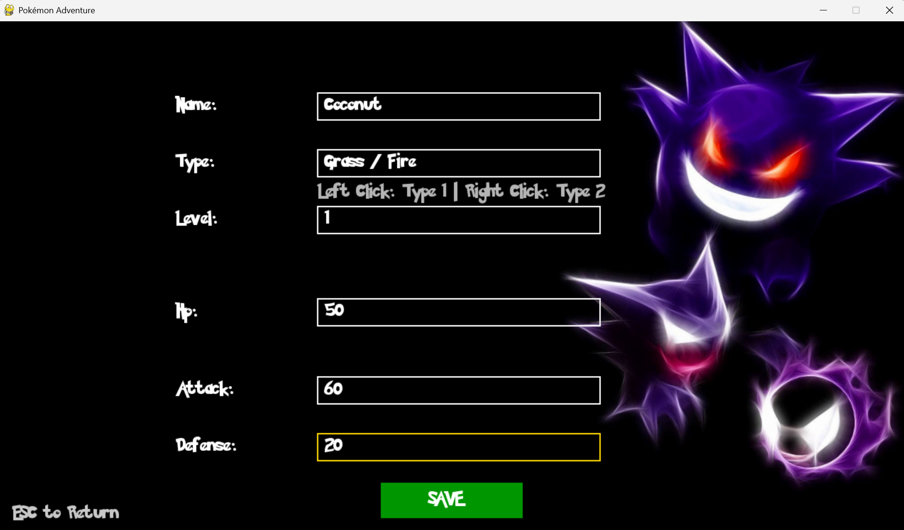

# 🎮 Pokémon Adventure Game

A fully-featured Pokémon battle game built with Python and Pygame, featuring turn-based combat, type effectiveness system, XP/leveling mechanics, Pokédex tracking, and custom Pokémon creation.


---

## 📑 Table of Contents

- [Features](#-features)
- [Screenshots & Demos](#-screenshots--demos)
- [Game Mechanics](#-game-mechanics)
  - [Battle System](#battle-system)
  - [Type Effectiveness](#type-effectiveness)
  - [Experience & Leveling](#experience--leveling)
  - [Pokédex System](#pokédex-system)
- [Tech Stack](#-tech-stack)
- [Prerequisites](#-prerequisites)
- [Installation](#-installation)
- [How to Play](#-how-to-play)
- [Project Structure](#-project-structure)
- [File Descriptions](#-file-descriptions)
- [Game Screens](#-game-screens)
- [Combat Guide](#-combat-guide)
- [Adding Custom Pokémon](#-adding-custom-pokémon)
- [Configuration](#-configuration)
- [Troubleshooting](#-troubleshooting)
- [Future Enhancements](#-future-enhancements)
- [Contributing](#-contributing)
- [Related Projects](#-related-projects)
- [License](#-license)
- [Author](#-author)
- [Acknowledgments](#-acknowledgments)

---

## ✨ Features

### 🎯 Core Gameplay
- **Turn-based Combat System** - Strategic Pokémon battles with attack calculations
- **Type Effectiveness** - Complete 18-type system with damage multipliers
- **XP & Leveling** - Pokémon gain experience and level up with stat increases
- **Evolution System** - Pokémon can evolve when reaching specific levels
- **HP Management** - Health tracking with damage reduction based on defense
- **Potion System** - Heal your Pokémon during battle (40 HP restoration)

### 📚 Pokédex Features
- **Automatic Tracking** - Records all encountered Pokémon
- **Capture System** - 50% chance to catch defeated Pokémon
- **Visual Status** - Displays caught vs. seen Pokémon with sprite graying
- **Persistent Storage** - JSON-based Pokédex saves between sessions

### 🎨 User Interface
- **Main Menu** - Clean navigation with Play, Pokédex, and Add Pokémon options
- **Pokémon Selection** - Grid-based sprite selection with stats preview
- **Battle Screen** - Dynamic combat interface with HP bars and action buttons
- **Game Over Screen** - Victory/defeat messages with replay options
- **Custom Pokémon Creator** - In-game tool to add new Pokémon

### ⚔️ Battle Actions
- **FIGHT** - Attack the opponent with type-based damage calculations
- **POTION** - Restore 40 HP (capped at max HP)
- **ESCAPE** - Flee from battle (instant game over)



---

## 🖼️ Screenshots & Demos

### Main Menu

*The main hub with access to all game features*

### Pokémon Selection

*Choose your fighter from available Pokémon*

### Battle Interface

*Intense turn-based combat with real-time HP tracking*

### Pokédex

*Track your caught and encountered Pokémon*

### Custom Pokémon Creation

*Create your own Pokémon with custom stats*

---

## 🎲 Game Mechanics

### Battle System

The combat system uses a turn-based approach where both player and opponent exchange attacks:

**Damage Calculation:**
```
base_damage = (attacker.attack / max(1, target.defense)) × 10
total_damage = base_damage × type_multiplier
```

**Damage Reduction:**
```
reduction = defender.defense × 0.1
final_damage = max(5, damage - reduction)
```

**Attack Accuracy:**
- 90% chance to hit successfully
- 10% chance to miss completely

### Type Effectiveness

Complete 18-type system implemented:

| Effectiveness | Multiplier | Example |
|--------------|------------|---------|
| Super Effective | 2.0x | Water → Fire |
| Not Very Effective | 0.5x | Fire → Water |
| No Effect | 0.0x | Normal → Ghost |
| Neutral | 1.0x | Normal → Normal |

**Implemented Types:**
- Normal, Fire, Water, Electric, Grass, Ice
- Fighting, Poison, Ground, Flying, Psychic
- Bug, Rock, Ghost, Dragon, Dark, Steel, Fairy

### Experience & Leveling

**XP System:**
- Gain 10 XP per victory
- Level up every 100 XP
- XP resets to 0 after leveling

**Level Up Bonuses:**
```
HP Max: +5
Attack: +3
Defense: +3
```

**Evolution:**
- Automatic evolution when level threshold is reached
- Evolves into specified evolution_id
- Inherits new stats from evolved form

### Pokédex System

**Tracking Rules:**
1. All encountered Pokémon are recorded as "SEEN"
2. 50% catch chance after defeating opponent
3. Successfully caught Pokémon marked as "CAPTURED"
4. Pokédex persists in `pokedex.json`

**Display Features:**
- Green text + full sprite = Captured
- Gray text + darkened sprite = Seen only

---

## 🛠️ Tech Stack

- **Python 3.8+** - Core programming language
- **Pygame 2.x** - Game engine and graphics
- **JSON** - Data persistence for Pokémon and Pokédex
- **Object-Oriented Design** - Modular class-based architecture

**Key Libraries:**
```python
pygame       # Graphics, events, sound
json         # Data storage and loading
random       # Battle mechanics (damage, catch rate)
sys          # System operations
```

---

## 📋 Prerequisites

### System Requirements
- **OS:** Windows, macOS, or Linux
- **Python:** Version 3.8 or higher
- **RAM:** 512 MB minimum
- **Storage:** 50 MB for game files and assets

### Required Python Packages
```bash
pygame>=2.0.0
```

---

## 🚀 Installation

### 1. Clone the Repository

```bash
git clone https://github.com/mahira-manico/pokemon.git
cd pokemon
```

### 2. Create Virtual Environment (Recommended)

**Linux/macOS:**
```bash
python3 -m venv venv
source venv/bin/activate
```

**Windows:**
```bash
python -m venv venv
venv\Scripts\activate
```

### 3. Install Dependencies

```bash
pip install -r requirements.txt
```

Or manually:
```bash
pip install pygame
```

### 4. Verify Project Structure

Ensure you have the following structure:
```
pokemon/
├── engine.py
├── pokemon.py
├── fight.py
├── type.py
├── menu.py
├── fight_screen.py
├── selection_screen.py
├── pokedex_screen.py
├── add_pokemon_screen.py
├── gameover_screen.py
├── constant.py
├── data/
│   └── pokemon.json
├── assets/
│   ├── images/
│   │   ├── pokemon_menu.jpg
│   │   ├── fight_background.jpg
│   │   ├── pokedex.jpg
│   │   ├── add_pokemon.jpg
│   │   ├── default.png
│   │   └── [pokemon sprites]
│   └── fonts/
│       ├── bold_pokemon.ttf
│       └── solid_pokemon.ttf
└── pokedex.json (auto-generated)
```

### 5. Run the Game

```bash
python engine.py
```

Or:
```bash
python3 engine.py
```

---

## 🎮 How to Play

### Starting the Game

1. **Launch** the game using `python engine.py`
2. **Main Menu** appears with three options:
   - **PLAY** - Start a battle
   - **POKEDEX** - View captured/seen Pokémon
   - **ADD POKEMON** - Create custom Pokémon

### Playing a Battle

1. Click **PLAY** from the main menu
2. **Select your Pokémon** from the grid
3. Click **FIGHT!** to enter battle
4. **Choose an action** each turn:
   - **FIGHT** - Attack the opponent
   - **POTION** - Heal 40 HP
   - **ESCAPE** - Flee from battle
5. **Win** by reducing opponent HP to 0
6. **Catch attempt** triggers automatically after victory

### Controls

| Action | Control |
|--------|---------|
| Navigate Menu | Mouse Click |
| Select Pokémon | Left Click on sprite |
| Battle Actions | Click action buttons |
| Return to Menu | ESC key |
| Replay Battle | R key (game over screen) |
| Main Menu | SPACE (game over screen) |

---

## 📂 Project Structure

```
pokemon/
│
├── engine.py                  # Main game loop and state management
├── pokemon.py                 # Pokemon class with stats and methods
├── fight.py                   # Battle logic and mechanics
├── type.py                    # Type effectiveness matrix
├── constant.py                # Game constants (colors, fonts, dimensions)
│
├── Screen Classes:
│   ├── menu.py                # Main menu interface
│   ├── fight_screen.py        # Battle display and UI
│   ├── selection_screen.py    # Pokemon selection grid
│   ├── pokedex_screen.py      # Pokédex viewer
│   ├── add_pokemon_screen.py  # Custom Pokémon creator
│   └── gameover_screen.py     # Victory/defeat overlay
│
├── data/
│   └── pokemon.json           # Pokemon database
│
├── assets/
│   ├── images/                # Backgrounds and sprites
│   └── fonts/                 # Custom Pokémon fonts
│
└── pokedex.json               # Player's Pokédex (auto-generated)
```

---

## 📄 File Descriptions

### Core Game Files

#### `engine.py` (Main Game Loop)
- **Purpose:** Central game controller managing all states
- **States:** MENU, SELECTION, FIGHT, POKEDEX, ADD_POKEMON, GAME_OVER
- **Functions:**
  - Event handling for all screens
  - State transitions
  - Screen rendering coordination
  - Game initialization

#### `pokemon.py` (Pokémon Class)
- **Attributes:** name, type, level, HP, attack, defense, XP, evolution data, sprite
- **Key Methods:**
  - `is_alive()` - Check if Pokémon has HP > 0
  - `take_damage(amount)` - Apply damage with defense reduction
  - `raise_xp_level(data)` - Level up and stat increases
  - `evolve(data)` - Evolution transformation
  - `add_pokemon()` - Static method to create new Pokémon

#### `fight.py` (Battle Logic)
- **Functions:**
  - `attack_power()` - Damage calculation with type effectiveness
  - `damage_multiplying()` - Type matchup calculator
  - `potion()` - HP restoration (40 HP, capped at max)
  - `catch_pokemon()` - 50% catch rate implementation
  - `save_to_pokedex()` - JSON persistence for caught Pokémon
  - `check_victory()` - Battle outcome determination

#### `type.py` (Type System)
- **Contains:** `TYPE_DAMAGE` dictionary
- **Structure:** 18 types × 18 types effectiveness matrix
- **Values:** 0 (immune), 0.5 (resistant), 0.75 (neutral-), 1 (neutral), 2 (super effective)

#### `constant.py` (Configuration)
- **Screen:** Width (1280), Height (720)
- **Colors:** WHITE, BLACK, RED, GREEN, BLUE, YELLOW, GOLD, etc.
- **Fonts:** FONT1 (bold, 45px), FONT2 (solid, 20px)

### Screen Classes

#### `menu.py` - Main Menu
- Background image with title
- Three buttons: PLAY, POKEDEX, ADD POKEMON
- Mouse click event handling

#### `selection_screen.py` - Pokémon Selector
- Grid display of available Pokémon (6 columns)
- Sprite rendering with selection highlight
- Info panel showing selected Pokémon stats
- "FIGHT!" button to start battle

#### `fight_screen.py` - Battle Display
- Battle background with Pokémon sprites
- HP bars for player and opponent
- XP bar for player
- Message box for combat text (3-line support)
- Action buttons: FIGHT, POTION, ESCAPE

#### `pokedex_screen.py` - Pokédex Viewer
- Scrollable list of encountered Pokémon
- Sprite display (darkened if not caught)
- Status text: "CAPTURED" (green) or "SEEN" (gray)
- ESC to return to menu

#### `add_pokemon_screen.py` - Custom Creator
- Input fields: Name, Type, Level, HP, Attack, Defense
- Default values provided
- SAVE button to add to database
- ESC to return to menu

#### `gameover_screen.py` - End Screen
- Semi-transparent overlay over battle screen
- Victory/defeat message display
- Controls hint: [R] Replay, [SPACE] Main Menu
- Color-coded title (gold for victory, red for defeat)

---

## 🎯 Game Screens

### Screen Flow Diagram

```
┌─────────────┐
│   MENU      │
│  [START]    │
└──────┬──────┘
       │
       ├─────► POKEDEX ──ESC──► MENU
       │
       ├─────► ADD_POKEMON ──SAVE──► MENU
       │
       ├─────► SELECTION
       │          │
       │          │ Choose Pokemon
       │          ▼
       │       FIGHT ──────► GAME_OVER
       │          │              │
       │          └─Flee─────────┤
       │                         │
       └─────────────────────────┴─R──► SELECTION
                                 │
                             SPACE──► MENU
```

---

## ⚔️ Combat Guide

### Battle Flow

1. **Initiation**
   - Random opponent selected from database
   - Player sees: "A wild Pokémon appeared!"

2. **Player Turn**
   - Choose: FIGHT, POTION, or ESCAPE
   - 90% attack accuracy, 10% miss chance

3. **Opponent Turn**
   - Automatic attack if still alive
   - Uses same damage calculation as player

4. **Victory Conditions**
   - Opponent HP reaches 0 → Player wins
   - Player HP reaches 0 → Player loses
   - ESCAPE clicked → Battle ends

5. **Post-Battle**
   - 50% catch chance if player wins
   - 10 XP awarded
   - Level up if XP ≥ 100
   - Pokédex updated

### Strategy Tips

💡 **Type Advantage**
- Check opponent type before attacking
- Use super-effective types (2x damage)
- Avoid not-very-effective attacks (0.5x damage)

💡 **HP Management**
- Use POTION when HP < 50%
- Potion restores 40 HP (max = hp_max)
- Each potion use allows opponent to attack

💡 **Defense Importance**
- High defense reduces incoming damage
- Damage reduction = defense × 0.1
- Minimum damage per hit = 5

💡 **Level Advantage**
- Higher levels = better stats
- Level up for +5 HP, +3 ATK, +3 DEF
- Evolution provides significant stat boost

---

## 🎨 Adding Custom Pokémon

### Using In-Game Creator

1. Click **ADD POKEMON** from main menu
2. Fill in the fields:
   - **Name:** Your Pokémon's name
   - **Type:** Single type (e.g., "Fire", "Water")
   - **Level:** Starting level (default: 1)
   - **HP:** Health points (default: 50)
   - **Attack:** Attack stat (default: 10)
   - **Defense:** Defense stat (default: 10)
3. Click **SAVE**
4. Pokémon is added with default sprite

### Manual JSON Addition

Edit `data/pokemon.json`:

```json
{
  "1": {
    "name": "Charizard",
    "type": ["Fire", "Flying"],
    "level": 36,
    "hp": 78,
    "attack": 84,
    "defense": 78,
    "evolution_id": null,
    "evolution_level": null,
    "sprite": "assets/images/charizard.png"
  },
  "2": {
    "name": "Bulbasaur",
    "type": ["Grass", "Poison"],
    "level": 5,
    "hp": 45,
    "attack": 49,
    "defense": 49,
    "evolution_id": "3",
    "evolution_level": 16,
    "sprite": "assets/images/bulbasaur.png"
  }
}
```

**Field Descriptions:**
- **name:** Display name (string)
- **type:** Array of types (max 2)
- **level:** Integer level (1-100)
- **hp:** Health points (integer)
- **attack:** Attack stat (integer)
- **defense:** Defense stat (integer)
- **evolution_id:** ID of evolution form (null if final stage)
- **evolution_level:** Level required to evolve (null if no evolution)
- **sprite:** Path to sprite image

### Adding Custom Sprites

1. Place sprite image in `assets/images/`
2. Recommended size: 64×64 to 250×250 pixels
3. Formats: PNG (with transparency), JPG
4. Update `sprite` field in JSON to point to new file

---

## ⚙️ Configuration

### Modifying Game Constants

Edit `constant.py`:

```python
# Screen Resolution
SCREEN_WIDTH = 1280  # Change to 1920 for Full HD
SCREEN_HEIGHT = 720  # Change to 1080 for Full HD

# Font Sizes
SMALL = 20   # UI text
MEDIUM = 40  # Headers
LARGE = 70   # Titles

# Custom Colors (RGB)
MY_COLOR = (123, 45, 67)
```

### Adjusting Game Balance

#### XP and Leveling (`pokemon.py`)
```python
def raise_xp_level(self, new_data):
    self.xp += 100
    if self.xp >= 100:  # Change XP threshold
        self.level += 1
        self.hp += 5        # Modify HP gain
        self.attack += 3    # Modify ATK gain
        self.defense += 3   # Modify DEF gain
```

#### Potion Healing (`fight.py`)
```python
def potion(self):
    heal_amount = 40  # Change healing value
    self.pokemon.hp = min(self.pokemon.hp + heal_amount, self.pokemon.hp_max)
```

#### Catch Rate (`fight.py`)
```python
def catch_pokemon(self):
    catching_chances = random.randint(1, 100)
    if catching_chances <= 50:  # Change catch rate (50 = 50%)
        return False, "Oh no! This pokemon escaped!"
    else:
        return True, "Good Job! You caught this pokemon!"
```

#### Attack Accuracy (`fight.py`)
```python
def attack_power(self, attacker, target):
    attack = random.randint(1, 10)
    if attack > 1:  # 90% accuracy (change threshold)
        # Attack hits
    else:
        return "Oops! Attack missed"
```

---

## 🐛 Troubleshooting

### Common Issues

#### Game Won't Start

**Error:** `ModuleNotFoundError: No module named 'pygame'`
```bash
# Solution:
pip install pygame
```

**Error:** `FileNotFoundError: assets/images/pokemon_menu.jpg`
```bash
# Solution: Verify assets folder exists and contains required images
ls assets/images/
```

#### Black Screen on Launch

**Cause:** Missing background images
**Solution:**
1. Check `assets/images/` folder exists
2. Verify these files are present:
   - `pokemon_menu.jpg`
   - `fight_background.jpg`
   - `pokedex.jpg`
   - `add_pokemon.jpg`

#### Font Rendering Issues

**Error:** `pygame.error: font not initialized`
```python
# Solution: Already handled in constant.py
pygame.font.init()
```

**Error:** Missing font files
```bash
# Solution: Verify fonts folder
ls assets/fonts/
# Should contain: bold_pokemon.ttf, solid_pokemon.ttf
```

#### JSON Errors

**Error:** `json.decoder.JSONDecodeError`
**Solution:** Delete corrupted JSON and restart:
```bash
rm pokedex.json
rm data/pokemon.json.backup
python engine.py
```

#### Performance Issues

**Symptom:** Low FPS, laggy gameplay
**Solutions:**
1. Reduce screen resolution in `constant.py`
2. Optimize sprite sizes (keep under 250×250px)
3. Close other applications
4. Update graphics drivers

### Debug Mode

Add to `engine.py` for debugging:
```python
def run(self):
    while self.running:
        print(f"Current State: {self.state}")  # Debug line
        self.event()
        self.draw()
        self.clock.tick(60)
```

---

## 🚀 Future Enhancements

### Planned Features

- [ ] **Multiplayer Mode** - Local PvP battles
- [ ] **Save/Load System** - Multiple save slots
- [ ] **Battle Animations** - Attack visual effects
- [ ] **Sound Effects** - Combat audio and music
- [ ] **More Pokémon** - Expand roster to 150+
- [ ] **Item System** - Battle items beyond potions
- [ ] **Status Effects** - Burn, poison, paralysis, etc.
- [ ] **Abilities** - Unique passive effects per Pokémon
- [ ] **Move Sets** - Multiple attacks to choose from
- [ ] **Gyms/Badges** - Progressive difficulty campaign
- [ ] **Trading System** - Exchange Pokémon between saves
- [ ] **Shiny Pokémon** - Rare color variants

### Community Requests

Want to contribute? Consider implementing:
- 📊 **Stats Screen** - Detailed Pokémon statistics page
- 🎭 **Trainer Customization** - Player avatar selection
- 🏆 **Achievement System** - Unlock rewards for milestones
- 📝 **Battle Log** - History of previous battles
- 🌍 **Regions/Maps** - Explorable world with wild encounters

---

## 🤝 Contributing

Contributions are welcome! Here's how you can help:

### Reporting Bugs

1. Check [existing issues](https://github.com/mahira-manico/pokemon/issues)
2. Create a new issue with:
   - Clear description
   - Steps to reproduce
   - Expected vs. actual behavior
   - Screenshots (if applicable)
   - System info (OS, Python version)

### Submitting Features

1. Fork the repository
2. Create a feature branch: `git checkout -b feature/AmazingFeature`
3. Commit changes: `git commit -m 'Add some AmazingFeature'`
4. Push to branch: `git push origin feature/AmazingFeature`
5. Open a Pull Request

### Code Style Guidelines

- Follow PEP 8 Python style guide
- Add docstrings to all functions
- Comment complex logic
- Use meaningful variable names
- Test thoroughly before submitting

---

## 🔗 Related Projects

### Group Version
- **Repository:** [samba-gomis/pokemon](https://github.com/samba-gomis/pokemon.git)
- **Description:** Collaborative version with additional features
- **Contributors:** Multiple developers

### My Solo Projects
- **Monitoring Dashboard:** [mahira-manico/monitoring_dashboard](https://github.com/mahira-manico/monitoring_dashboard.git)
  - System monitoring tool with Python, HTML, CSS
  - Real-time CPU, memory, and process tracking

---

## 📜 License

This project is open source and available under the [MIT License](LICENSE).

```
MIT License

Copyright (c) 2025 Mahira Manico

Permission is hereby granted, free of charge, to any person obtaining a copy
of this software and associated documentation files (the "Software"), to deal
in the Software without restriction, including without limitation the rights
to use, copy, modify, merge, publish, distribute, sublicense, and/or sell
copies of the Software, and to permit persons to whom the Software is
furnished to do so, subject to the following conditions:

The above copyright notice and this permission notice shall be included in all
copies or substantial portions of the Software.

THE SOFTWARE IS PROVIDED "AS IS", WITHOUT WARRANTY OF ANY KIND, EXPRESS OR
IMPLIED, INCLUDING BUT NOT LIMITED TO THE WARRANTIES OF MERCHANTABILITY,
FITNESS FOR A PARTICULAR PURPOSE AND NONINFRINGEMENT.
```

---

## 👤 Author

**Mahira Manico**
- GitHub: [@mahira-manico](https://github.com/mahira-manico)
- Project: [pokemon](https://github.com/mahira-manico/pokemon.git)

*This is a solo project developed entirely by me as a learning exercise in game development, object-oriented programming, and Python/Pygame.*

---

## 🙏 Acknowledgments

### Technologies & Libraries
- **Pygame Community** - For excellent documentation and tutorials
- **Python Software Foundation** - For the Python programming language
- **Nintendo/Game Freak** - For the original Pokémon concept (fan project, no commercial use)

### Resources
- Type effectiveness chart based on official Pokémon games
- Sprite assets from community resources
- Font design inspired by official Pokémon typography

### Inspiration
This project was created as an educational exercise to learn:
- Game development fundamentals
- Object-oriented programming patterns
- Event-driven architecture
- JSON data persistence
- UI/UX design in Pygame

**Special Thanks** to the open-source community for tutorials and resources that made this project possible.

---

## 📧 Contact & Support

### Questions or Issues?
- 🐛 **Bug Reports:** [Open an issue](https://github.com/mahira-manico/pokemon/issues/new)
- 💡 **Feature Requests:** [Open an issue](https://github.com/mahira-manico/pokemon/issues/new)
- 📖 **Documentation:** Check this README first

### Stay Updated
- ⭐ **Star this repo** to show support
- 👀 **Watch** for updates and new features
- 🍴 **Fork** to create your own version

---

**Repository:** https://github.com/mahira-manico/pokemon.git

**Made with ❤️ and ☕ by Mahira Manico**

*Last Updated: February 2026*
